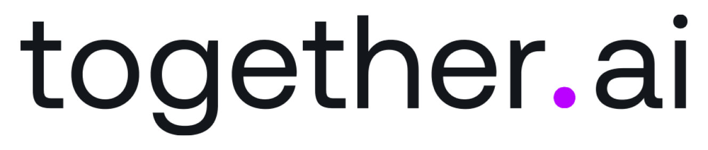

        
    <h1 align="center">📱 Nexa 📱</h1>

You get **Nexa**, a Whatsapp agent that can engage with users in a "realistic" way, inspired by the great film [Ex Machina](https://www.imdb.com/es-es/title/tt0470752/). Ok, you won't find a fully sentient robot here, but you **will** have some pretty interesting Whatsapp conversations.

>You can think of it as a modern reinterpretation of the Turing Test 🤣

Nexa is capable of:
* Receiving and sending Whatsapp messages 📲
* Understanding your voice 🗣️
* Recognizing your images 🖼️
* Sending voice notes back 🎤
* Sharing updates about its "daily activities" 🚣
* Sending you images of its current activities 🖼️
  ## modules I used: 
<table>
  <tr>
    <th>Technology</th>
    <th>Description</th>
  </tr>
  <tr>
    <td></td>
    <td>Powering the project with Llama 3.3, Llama 3.2 Vision, and Whisper. Groq models are awesome (and fast!!)</td>
  </tr>
  <tr>
    <td></td>
    <td>Serving as the long-term database, enabling Nexa agent to recall details you shared months ago.</td>
  </tr>
  <tr>
    <td></td>
    <td>Deploying our containers easily to Google Cloud Platform</td>
  </tr>
  <tr>
    <td></td>
    <td>business logic for production - ready LangGraph workflows</td>
  </tr>
  <tr>
    <td></td>
    <td>Amazing TTS models</td>
  </tr>
  <tr>
    <td></td>
    <td>Behind Nexa's image generation process</td>
  </tr>
</table>

